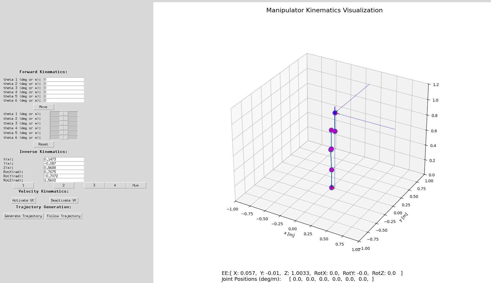

# Final Project: Implementation of Forward and Inverse Kinematics in Simulator and Kinova for a 6 DOF Kinova Gen3lite arm
By Xavier Nishikawa & Julian Shah
based on code from Kenechukwu Mbanisi

This project is the Final Project code for the Fundamentals of Robotics class taught by Kenechukwu Mbanisi (Kene). 
It builds of the simulator built by Kene to implement analytical and numerical inverse kinematics for a 6-DOF robot
arm based off of the Kinova Gen3lite. While there is also a framework for 2-DOF and SCARA type robot arms, it isn't used. 

Code for Sim is in sim branch of this same repo!

### Disclosure for AI

No AI models were used in developing the code.


An example for what the visualization tool looks like

## Requirements

* Step 1: Install Python 3 (if not already installed)
* Step 2: Locally download this repository from Github
* Step 3: Install all required Python packages using pip (or manually)

## How to Run

- To run the main scripts, use the command below
``` bash
$ python3 main_arm.py --robot_type 6-dof
# this configures the six-DOF arm
```

## **Forward velocity kinematics (FVK)**

The forward velocity kinematics approach uses the Jacobian matrix to relate joint velocities to the end effector (EE) velocity. In summary, when the joints move at certain speeds, the Jacobian helps calculate how fast and in what direction the EE will move (which axis, can move in multiple axes at the same time as well). This is useful for tasks like drawing paths or smooth motion. The joint velocity vector is multiplied by the Jacobian to get the linear and angular velocity of the EE. It’s a key part of controlling robots in real time, especially when planning smooth trajectories.

Our implementation of forward velocity kinematics
[](https://youtu.be/Oe_4IovfcwI)


## **Inverse position kinematics (IPK)**
### Numerical

The numerical inverse kinematics approach involves the Newton-Raphson method for optimization. In essence, we calculate
the current position of the end effector (EE) in relation to the desired position and multiply the error by the jacobian
to get new joint positions. This then happens until the EE is within an error threshold or an iteration limit is reached.
It is possible that upon inputting a desired and reachable point that it requires a few presses of the NUM SOLVE button
until the final solution is reached. This is because the path to the desired position may involve passing through
singularities which will erratically move the robot due to a product of a pseudo inverse jacobian used for calculations.

Note: orientation is not accounted for in this approach.

[](https://youtu.be/kvo6tixsD2E)

### Google Doc Link
https://docs.google.com/document/d/19U1ljsSrzBksBxyDy0hxKwHY6oN1c-oq/edit?usp=sharing&ouid=107514173378691185514&rtpof=true&sd=true
